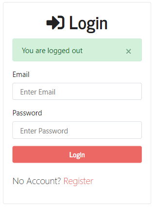

# Node/Express with Passport Authorization Project

## Scripts

npm start (deployment)
npm run dev (development with nodemon)

## ejs Templating Engine

Put every line of javascript inside <% %>
e.g. <% errors.forEach(error => { %>
<% // some code... %>
<% >}) %>

To output something / a variable <%= %>
e.g. <%= error[0].msg %>

Made following [Traversy's tutorial](https://www.youtube.com/watch?v=6FOq4cUdH8k&ab_channel=TraversyMedia)
